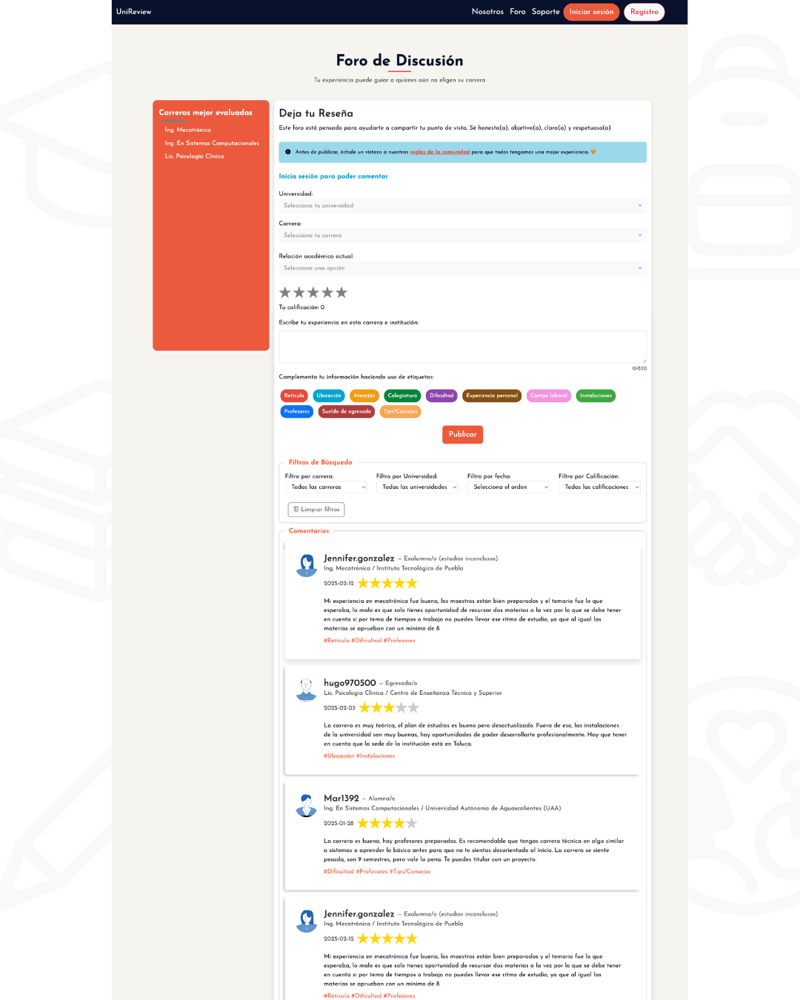

# UniReview - Frontend

UniReview es una plataforma web que busca convertirse en un punto de encuentro donde los jóvenes mexicanos puedan consultar y compartir experiencias reales sobre carreras universitarias. A través de reseñas, opiniones y debates abiertos entre estudiantes, egresados y postulantes, UniReview ofrece una visión más clara sobre lo que implica cada carrera profesional: sus retos, oportunidades y posibles salidas laborales.

UniReview is a web platform designed to become a meeting point where young people in Mexico can explore and share real experiences about university degrees. Through reviews, feedback, and open discussions between students, graduates, and applicants, UniReview provides a clearer picture of what each degree involves — including its challenges, opportunities, and career outlook.

Este repositorio contiene la **versión limpia del frontend**, desarrollada como parte de un proyecto en equipo.  
This repository contains the **clean version of the frontend**, developed as part of a team project.

---

## 🚀 Tecnologías utilizadas | Technologies & Libraries Used

- HTML5
- CSS3
- JavaScript (vanilla)
- Bootstrap
- [AOS](https://michalsnik.github.io/aos/) – Animaciones al hacer scroll  
- [Swiper](https://swiperjs.com/) – Carruseles móviles y responsivos
- Google Fonts – Tipografías personalizadas

---

## 🎨 Funcionalidades principales | Main Features

- Login con navegación dinámica según el tipo de usuario  
  Login with dynamic navigation based on user role
- Visualización de resultados de evaluaciones  
  Evaluation results view
- Panel de administración para gestión de usuarios y cuestionarios  
  Admin panel for managing users and questionnaires
- Diseño responsivo y amigable  
  Responsive and user-friendly design

---

## 📸 Vistas del sistema | UI Screenshots

<sub>Algunas de las pantallas principales del sistema | Key UI screens:</sub>

  




---

## 📁 Estructura del proyecto | Project Structure

```bash
/
├── index.html
├── css/
│   └── styles.css
├── js/
│   └── main.js
├── assets/
│   └── imágenes, íconos, etc. | images, icons, etc.


---